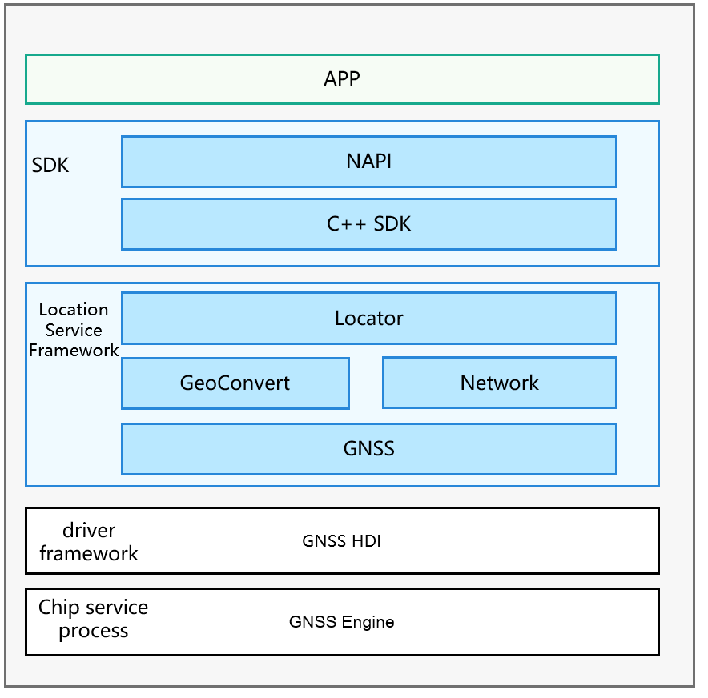

# Location<a name="EN-US_TOPIC_0000001080646118"></a>

-   [Introduction](#section11660541593)
-   [Directory Structure](#section161941989596)
-   [Constraints](#section119744591305)
-   [Usage](#section1312121216216)
    -   [Available APIs](#section1551164914237)
    -   [Usage Guidelines](#section129654513264)

-   [Repositories Involved](#section1371113476307)

## Introduction<a name="section11660541593"></a>

People take their mobile devices wherever they go. Mobile devices have become a necessity in people's daily routines, whether it be for looking at the weather forecast, browsing news, hailing a taxi, navigating, or recording data from a workout. All these activities are so much associated with the location services on mobile devices.

With the location awareness capability offered by OpenHarmony, mobile devices will be able to obtain real-time, accurate location data. Building location awareness into your application can also lead to a better contextual experience for application users.

Your application can call location-specific APIs to obtain the location information of a mobile device for offering location-based services such as drive navigation and motion track recording.

**Basic Concepts**

Location awareness helps determine where a mobile device locates. The system identifies the location of a mobile device with its coordinates, and uses location technologies such as Global Navigation Satellite System \(GNSS\) and network positioning \(for example, base station positioning or WLAN/Bluetooth positioning\) to provide diverse location-based services. These advanced location technologies make it possible to obtain the accurate location of the mobile device, regardless of whether it is indoors or outdoors.

-   **Coordinate**

    A coordinate describes a location on the earth using the longitude and latitude in reference to the World Geodetic Coordinate System 1984.

-   **GNSS positioning**

    GNSS positioning locates a mobile device by using the location algorithm offered by the device chip to compute the location information provided by the Global Navigation Satellite System, for example, GPS, GLONASS, BeiDou, and Galileo. Whichever positioning system will be used during the location process depends on a hardware capability of the device. 

-   **Base station positioning**

    Base station positioning estimates the current location of a mobile device based on the location of the resident base station in reference to the neighboring base stations. This technology provides only a low accuracy and requires access to the cellular network.

-   **WLAN or Bluetooth positioning**

    WLAN or Bluetooth positioning estimates the current location of a mobile device based on the locations of WLANs and Bluetooth devices that can be discovered by the device. The location accuracy of this technology depends on the distribution of fixed WLAN access points \(APs\) and Bluetooth devices around the device. A high density of WLAN APs and Bluetooth devices can produce a more accurate location result than base station positioning. This technology also requires access to the network. 


**Figure  1**  Location subsystem architecture<a name="fig4460722185514"></a>  




## Directory Structure<a name="section161941989596"></a>

```
/base/location               # Source code
  ├── etc                   # Code for the service startup configuration
  ├── interfaces            # APIs
  ├── profile               # Code for service declaration
  ├── location_common       # Common code
  ├── location_locator      # Location service management code
  ├── location_gnss         # GNSS positioning service code
  ├── location_network      # Network positioning service code
  ├── location_passive      # Passive positioning service code
  ├── location_geocode      # Geocoding service code
  ├── test                  # Test code
  ├── utils                 # Common utility code
```

## Constraints<a name="section119744591305"></a>

 - Your application can use the location function only after the user has granted the permission and turned on the function. If the location function is off, the system will not provide the location service for any application.

 - Since the location information is considered sensitive, your application still needs to obtain the location access permission from the user even if the user has turned on the location function. The system will provide the location service for your application only after it has been granted the permission to access the device location information.

## Usage<a name="section1312121216216"></a>

### Available APIs<a name="section1551164914237"></a>

1. The following table describes APIs available for obtaining device location information.

**Table  1**  APIs for obtaining device location information

| Interface Name | function description |
| -------- | -------- |
| on(type:&nbsp;'locationChange',&nbsp;request:&nbsp;LocationRequest,&nbsp;callback:&nbsp;Callback&lt;Location&gt;)&nbsp;:&nbsp;void | Enable location change subscription and initiate a location request. |
| off(type:&nbsp;'locationChange',&nbsp;callback?:&nbsp;Callback&lt;Location&gt;)&nbsp;:&nbsp;void | Disable the location change subscription and delete the corresponding location request. |
| on(type:&nbsp;'locationServiceState',&nbsp;callback:&nbsp;Callback&lt;boolean&gt;)&nbsp;:&nbsp;void | The subscription location service status changes. |
| off(type:&nbsp;'locationServiceState',&nbsp;callback:&nbsp;Callback&lt;boolean&gt;)&nbsp;:&nbsp;void | Unsubscribe from location service status changes. |
| on(type:&nbsp;'cachedGnssLocationsReporting',&nbsp;request:&nbsp;CachedGnssLocationsRequest,&nbsp;callback:&nbsp;Callback&lt;Array&lt;Location&gt;&gt;)&nbsp;:&nbsp;void; | Subscribe to cache GNSS location reporting. |
| off(type:&nbsp;'cachedGnssLocationsReporting',&nbsp;callback?:&nbsp;Callback&lt;Array&lt;Location&gt;&gt;)&nbsp;:&nbsp;void; | Unsubscribe from cached GNSS location reporting. |
| on(type:&nbsp;'gnssStatusChange',&nbsp;callback:&nbsp;Callback&lt;SatelliteStatusInfo&gt;)&nbsp;:&nbsp;void; | Subscribe to satellite status update events. |
| off(type:&nbsp;'gnssStatusChange',&nbsp;callback?:&nbsp;Callback&lt;SatelliteStatusInfo&gt;)&nbsp;:&nbsp;void; | Unsubscribe from satellite status update events. |
| on(type:&nbsp;'nmeaMessageChange',&nbsp;callback:&nbsp;Callback&lt;string&gt;)&nbsp;:&nbsp;void; | Subscribe to GNSS NMEA information change reporting. |
| off(type:&nbsp;'nmeaMessageChange',&nbsp;callback?:&nbsp;Callback&lt;string&gt;)&nbsp;:&nbsp;void; | Unsubscribe to GNSS NMEA information change reporting. |
| on(type:&nbsp;'fenceStatusChange',&nbsp;request:&nbsp;GeofenceRequest,&nbsp;want:&nbsp;WantAgent)&nbsp;:&nbsp;void; | Add a fence and subscribe to the event reporting of the fence. |
| off(type:&nbsp;'fenceStatusChange',&nbsp;request:&nbsp;GeofenceRequest,&nbsp;want:&nbsp;WantAgent)&nbsp;:&nbsp;void; | Delete the fence and unsubscribe from the fence event. |
| getCurrentLocation(request:&nbsp;CurrentLocationRequest,&nbsp;callback:&nbsp;AsyncCallback&lt;Location&gt;)&nbsp;:&nbsp;void | Obtain the current location and use the callback callback to return the result asynchronously. |
| getCurrentLocation(request?:&nbsp;CurrentLocationRequest)&nbsp;:&nbsp;Promise&lt;Location&gt; | Obtains the current location and returns the result asynchronously in Promise mode. |
| getLastLocation(callback:&nbsp;AsyncCallback&lt;Location&gt;)&nbsp;:&nbsp;void | Obtain the last location and use the callback callback to return the result asynchronously. |
| getLastLocation()&nbsp;:&nbsp;Promise&lt;Location&gt; | Obtains the last location and returns the result asynchronously in Promise mode. |
| isLocationEnabled(callback:&nbsp;AsyncCallback&lt;boolean&gt;)&nbsp;:&nbsp;void | Check whether the location service is enabled and callback is used to return the result asynchronously. |
| isLocationEnabled()&nbsp;:&nbsp;Promise&lt;boolean&gt; | Check whether the location service is enabled and return the result asynchronously in Promise mode. |
| requestEnableLocation(callback:&nbsp;AsyncCallback&lt;boolean&gt;)&nbsp;:&nbsp;void | Request to enable the location service and use the callback callback to return the result asynchronously. |
| requestEnableLocation()&nbsp;:&nbsp;Promise&lt;boolean&gt; | Request to enable the location service and return the result asynchronously in Promise mode. |
| enableLocation(callback:&nbsp;AsyncCallback&lt;boolean&gt;)&nbsp;:&nbsp;void | Enable the location service and use the callback callback to return the result asynchronously. |
| enableLocation()&nbsp;:&nbsp;Promise&lt;boolean&gt; | Start the location service and return the result asynchronously in Promise mode. |
| disableLocation(callback:&nbsp;AsyncCallback&lt;boolean&gt;)&nbsp;:&nbsp;void | Disable the location service and use the callback callback to return the result asynchronously. |
| disableLocation()&nbsp;:&nbsp;Promise&lt;boolean&gt; | Stop the location service and return the result asynchronously in Promise mode. |
| getCachedGnssLocationsSize(callback:&nbsp;AsyncCallback&lt;number&gt;)&nbsp;:&nbsp;void; | Obtains the number of cached GNSS locations and uses the callback callback to return the result asynchronously. |
| getCachedGnssLocationsSize()&nbsp;:&nbsp;Promise&lt;number&gt;; | Obtains the number of cached GNSS locations and returns the result asynchronously in Promise mode. |
| flushCachedGnssLocations(callback:&nbsp;AsyncCallback&lt;boolean&gt;)&nbsp;:&nbsp;void; | Obtains all GNSS cache locations, clears the GNSS cache queue, and invokes callback to return results asynchronously. |
| flushCachedGnssLocations()&nbsp;:&nbsp;Promise&lt;boolean&gt;; | Obtains all GNSS cache locations, clears the GNSS cache queue, and returns results asynchronously in Promise mode. |
| sendCommand(command:&nbsp;LocationCommand,&nbsp;callback:&nbsp;AsyncCallback&lt;boolean&gt;)&nbsp;:&nbsp;void; | Send an extended command to the location service subsystem and use the callback callback to return the result asynchronously. |
| sendCommand(command:&nbsp;LocationCommand)&nbsp;:&nbsp;Promise&lt;boolean&gt;; | Sends extended commands to the location service subsystem and returns results asynchronously in Promise mode. |
| isLocationPrivacyConfirmed(type&nbsp;:&nbsp;LocationPrivacyType,&nbsp;callback:&nbsp;AsyncCallback&lt;boolean&gt;)&nbsp;:&nbsp;void; | This interface is used to query whether a user agrees with the privacy statement of the LCS service. The callback callback interface is used to return the result asynchronously. |
| isLocationPrivacyConfirmed(type&nbsp;:&nbsp;LocationPrivacyType,)&nbsp;:&nbsp;Promise&lt;boolean&gt;; | This interface is used to query whether a user agrees with the privacy statement of the LCS service. The result is returned asynchronously in Promise mode. |
| setLocationPrivacyConfirmStatus(type&nbsp;:&nbsp;LocationPrivacyType,&nbsp;isConfirmed&nbsp;:&nbsp;boolean,&nbsp;callback:&nbsp;AsyncCallback&lt;boolean&gt;)&nbsp;:&nbsp;void; | Set and record whether the user agrees to the privacy statement of the LCS service and use the callback callback to return the result asynchronously. |
| setLocationPrivacyConfirmStatus(type&nbsp;:&nbsp;LocationPrivacyType,&nbsp;isConfirmed&nbsp;:&nbsp;boolean)&nbsp;:&nbsp;Promise&lt;boolean&gt;; | Set and record whether the user agrees to the privacy statement of the LCS. The result is returned asynchronously in Promise mode. |


### Usage Guidelines<a name="section129654513264"></a>

**Obtaining the device location information:**

1.  Before using basic location capabilities, check whether your application has been granted the permission to access the device location information. If not, your application needs to obtain the permission from the user.

    The system provides the following location permissions:

    -   ohos.permission.LOCATION
    -   ohos.permission.LOCATION\_IN\_BACKGROUND

    The  **ohos.permission.LOCATION**  permission is a must if your application needs to access the device location information.

    If your application needs to access the device location information when running on the background, it must be allowed to run on the background in the configuration file and also granted the  **ohos.permission.LOCATION\_IN\_BACKGROUND**  permission. In this way, the system continues to report device location information even when your application moves to the background.

    To allow your application to access device location information, you can declare the required permissions in the  **config.json**  file of your application. The sample code is as follows:

    ```
    {
        "reqPermissions": [{
            "name": "ohos.permission.LOCATION",
            "reason": "$string:reason_description",
            "usedScene": {
                "ability": ["com.myapplication.LocationAbility"],
                "when": "inuse"
            }, {
            ...
            }
        ]
    }
    ```

2.  Import the geolocation module. All function APIs related to basic location capabilities are provided through this module.

   ```
   import geolocation from '@ohos.geolocation';
   ```

3.  Instantiates the LocationRequest object to notify the system of the type of location service to be provided to the application and the frequency of reporting location results.

    **Method 1:**

    To better serve your needs for using APIs, the system has categorized APIs into different packages to match your common use cases of the location function. In this way, you can directly use the APIs specific to a certain use case, making application development much easier. The following table lists the use cases currently supported.

    **Table  2**  Common use cases of the location function

    <a name="table1758483964015"></a>
    <table><thead align="left"><tr id="row458433920403"><th class="cellrowborder" valign="top" width="14.92850714928507%" id="mcps1.2.4.1.1"><p id="p12584143911402"><a name="p12584143911402"></a><a name="p12584143911402"></a>Use Case</p>
    </th>
    <th class="cellrowborder" valign="top" width="25.16748325167483%" id="mcps1.2.4.1.2"><p id="p125842039174016"><a name="p125842039174016"></a><a name="p125842039174016"></a>Constant</p>
    </th>
    <th class="cellrowborder" valign="top" width="59.904009599040094%" id="mcps1.2.4.1.3"><p id="p10585139134010"><a name="p10585139134010"></a><a name="p10585139134010"></a>Description</p>
    </th>
    </tr>
    </thead>
    <tbody><tr id="row858573914011"><td class="cellrowborder" valign="top" width="14.92850714928507%" headers="mcps1.2.4.1.1 "><p id="p258518398406"><a name="p258518398406"></a><a name="p258518398406"></a>Navigation</p>
    </td>
    <td class="cellrowborder" valign="top" width="25.16748325167483%" headers="mcps1.2.4.1.2 "><p id="p1758513915403"><a name="p1758513915403"></a><a name="p1758513915403"></a>SCENE_NAVIGATION</p>
    </td>
    <td class="cellrowborder" valign="top" width="59.904009599040094%" headers="mcps1.2.4.1.3 "><p id="p4585183934017"><a name="p4585183934017"></a><a name="p4585183934017"></a>Applicable when your application needs to obtain the real-time location of a mobile device outdoors, such as navigation for driving or walking. In this scenario, the GNSS positioning technology is mainly used to ensure the location accuracy. However, due to its limitations, the technology may be unable to provide the location service when navigation is just started or when the user moves into a shielded environment such as indoors or a garage. To resolve this issue, the system uses the network positioning technology as an alternative to provide the location service for your application until the GNSS can provide stable location results. This helps achieve a smooth navigation experience for users.</p>
    <p id="p12585039174017"><a name="p12585039174017"></a><a name="p12585039174017"></a>By default, the system reports location results at a minimal interval of 1s. To adopt this use case, you must declare the <strong id="b975004216292"><a name="b975004216292"></a><a name="b975004216292"></a>ohos.permission.LOCATION</strong> permission and obtain user authorization.</p>
    </td>
    </tr>
    <tr id="row1458543934016"><td class="cellrowborder" valign="top" width="14.92850714928507%" headers="mcps1.2.4.1.1 "><p id="p258523944018"><a name="p258523944018"></a><a name="p258523944018"></a>Trajectory tracking</p>
    </td>
    <td class="cellrowborder" valign="top" width="25.16748325167483%" headers="mcps1.2.4.1.2 "><p id="p9585133904019"><a name="p9585133904019"></a><a name="p9585133904019"></a>SCENE_TRAJECTORY_TRACKING</p>
    </td>
    <td class="cellrowborder" valign="top" width="59.904009599040094%" headers="mcps1.2.4.1.3 "><p id="p1358553984019"><a name="p1358553984019"></a><a name="p1358553984019"></a>Applicable when your application needs to record user trajectories, for example, the track recording function of sports applications. In this scenario, the GNSS positioning technology is mainly used to ensure the location accuracy.</p>
    <p id="p9585153917401"><a name="p9585153917401"></a><a name="p9585153917401"></a>By default, the system reports location results at a minimal interval of 1s. To adopt this use case, you must declare the <strong id="b18532492293"><a name="b18532492293"></a><a name="b18532492293"></a>ohos.permission.LOCATION</strong> permission and obtain user authorization.</p>
    </td>
    </tr>
    <tr id="row258503916400"><td class="cellrowborder" valign="top" width="14.92850714928507%" headers="mcps1.2.4.1.1 "><p id="p1658513396408"><a name="p1658513396408"></a><a name="p1658513396408"></a>Ride hailing</p>
    </td>
    <td class="cellrowborder" valign="top" width="25.16748325167483%" headers="mcps1.2.4.1.2 "><p id="p6585639124019"><a name="p6585639124019"></a><a name="p6585639124019"></a>SCENE_CAR_HAILING</p>
    </td>
    <td class="cellrowborder" valign="top" width="59.904009599040094%" headers="mcps1.2.4.1.3 "><p id="p125857398404"><a name="p125857398404"></a><a name="p125857398404"></a>Applicable when your application needs to obtain the current location of a user who is hailing a taxi.</p>
    <p id="p1158563974014"><a name="p1158563974014"></a><a name="p1158563974014"></a>By default, the system reports location results at a minimal interval of 1s. To adopt this use case, you must declare the <strong id="b91255452918"><a name="b91255452918"></a><a name="b91255452918"></a>ohos.permission.LOCATION</strong> permission and obtain user authorization.</p>
    </td>
    </tr>
    <tr id="row19585839134012"><td class="cellrowborder" valign="top" width="14.92850714928507%" headers="mcps1.2.4.1.1 "><p id="p558583924020"><a name="p558583924020"></a><a name="p558583924020"></a>Life service</p>
    </td>
    <td class="cellrowborder" valign="top" width="25.16748325167483%" headers="mcps1.2.4.1.2 "><p id="p18585143914013"><a name="p18585143914013"></a><a name="p18585143914013"></a>SCENE_DAILY_LIFE_SERVICE</p>
    </td>
    <td class="cellrowborder" valign="top" width="59.904009599040094%" headers="mcps1.2.4.1.3 "><p id="p1585193994013"><a name="p1585193994013"></a><a name="p1585193994013"></a>Applicable when your application only needs the approximate user location for recommendations and push notifications in scenarios such as when the user is browsing news, shopping online, and ordering food.</p>
    <p id="p9585183984012"><a name="p9585183984012"></a><a name="p9585183984012"></a>By default, the system reports location results at a minimal interval of 1s. To adopt this use case, you must declare the <strong id="b310562153012"><a name="b310562153012"></a><a name="b310562153012"></a>ohos.permission.LOCATION</strong> permission and obtain user authorization.</p>
    </td>
    </tr>
    <tr id="row16585153914013"><td class="cellrowborder" valign="top" width="14.92850714928507%" headers="mcps1.2.4.1.1 "><p id="p358533911403"><a name="p358533911403"></a><a name="p358533911403"></a>Power efficiency</p>
    </td>
    <td class="cellrowborder" valign="top" width="25.16748325167483%" headers="mcps1.2.4.1.2 "><p id="p12585153974020"><a name="p12585153974020"></a><a name="p12585153974020"></a>SCENE_NO_POWER</p>
    </td>
    <td class="cellrowborder" valign="top" width="59.904009599040094%" headers="mcps1.2.4.1.3 "><p id="p75851391407"><a name="p75851391407"></a><a name="p75851391407"></a>Applicable when your application does not proactively start the location service for a higher battery efficiency. When responding to another application requesting the same location service, the system marks a copy of the location result to your application. In this way, your application will not consume extra power for obtaining the user location.</p>
    <p id="p258533913402"><a name="p258533913402"></a><a name="p258533913402"></a>By default, the system reports location results at a minimal interval of 1s. To adopt this use case, you must declare the <strong id="b169496663012"><a name="b169496663012"></a><a name="b169496663012"></a>ohos.permission.LOCATION</strong> permission and obtain user authorization.</p>
    </td>
    </tr>
    </tbody>
    </table>

    The following example instantiates the  **RequestParam**  object for navigation:

    ```
    RequestParam requestParam = new RequestParam(RequestParam.SCENE_NAVIGATION);
    ```

    **Method 2:**

    If the predefined use cases do not meet your needs, you can also use the basic location priority policies provided by the system.

    ```
       export enum LocationRequestPriority {
            UNSET = 0x200,
            ACCURACY,
            LOW_POWER,
            FIRST_FIX,
        }
    ```
    
    **Table  4**  Location priority policies

    <a name="table1276019614412"></a>
    <table><thead align="left"><tr id="row07609619412"><th class="cellrowborder" valign="top" width="29.592959295929592%" id="mcps1.2.4.1.1"><p id="p176096144113"><a name="p176096144113"></a><a name="p176096144113"></a>Policy</p>
    </th>
    <th class="cellrowborder" valign="top" width="27.082708270827084%" id="mcps1.2.4.1.2"><p id="p8760368415"><a name="p8760368415"></a><a name="p8760368415"></a>Constant</p>
    </th>
    <th class="cellrowborder" valign="top" width="43.32433243324332%" id="mcps1.2.4.1.3"><p id="p127601064415"><a name="p127601064415"></a><a name="p127601064415"></a>Description</p>
    </th>
    </tr>
    </thead>
    <tbody><tr id="row67609613412"><td class="cellrowborder" valign="top" width="29.592959295929592%" headers="mcps1.2.4.1.1 "><p id="p207608664111"><a name="p207608664111"></a><a name="p207608664111"></a>Location accuracy priority</p>
    </td>
    <td class="cellrowborder" valign="top" width="27.082708270827084%" headers="mcps1.2.4.1.2 "><p id="p976017620419"><a name="p976017620419"></a><a name="p976017620419"></a>PRIORITY_ACCURACY</p>
    </td>
    <td class="cellrowborder" valign="top" width="43.32433243324332%" headers="mcps1.2.4.1.3 "><p id="p1976017624110"><a name="p1976017624110"></a><a name="p1976017624110"></a>This policy mainly uses the GNSS positioning technology. In an open area, the technology can achieve the meter-level location accuracy, depending on the hardware performance of the device. However, in a shielded environment, the location accuracy may significantly decrease.</p>
    <p id="p1076036154113"><a name="p1076036154113"></a><a name="p1076036154113"></a>To use this policy, you must declare the <strong id="b1768101919305"><a name="b1768101919305"></a><a name="b1768101919305"></a>ohos.permission.LOCATION</strong> permission and obtain user authorization.</p>
    </td>
    </tr>
    <tr id="row1676014604116"><td class="cellrowborder" valign="top" width="29.592959295929592%" headers="mcps1.2.4.1.1 "><p id="p576056104110"><a name="p576056104110"></a><a name="p576056104110"></a>Fast location priority</p>
    </td>
    <td class="cellrowborder" valign="top" width="27.082708270827084%" headers="mcps1.2.4.1.2 "><p id="p14760965417"><a name="p14760965417"></a><a name="p14760965417"></a>PRIORITY_FIRST_FIX</p>
    </td>
    <td class="cellrowborder" valign="top" width="43.32433243324332%" headers="mcps1.2.4.1.3 "><p id="p1760106164114"><a name="p1760106164114"></a><a name="p1760106164114"></a>This policy uses the GNSS positioning, base station positioning, WLAN positioning, and Bluetooth positioning technologies simultaneously to obtain the device location in both the indoor and outdoor scenarios. When all positioning technologies provide a location result, the system provides the most accurate location result for your application. This policy can lead to significant hardware resource consumption and power consumption.</p>
    <p id="p10760965410"><a name="p10760965410"></a><a name="p10760965410"></a>To use this policy, you must declare the <strong id="b1154417237307"><a name="b1154417237307"></a><a name="b1154417237307"></a>ohos.permission.LOCATION</strong> permission and obtain user authorization.</p>
    </td>
    </tr>
    <tr id="row276017654111"><td class="cellrowborder" valign="top" width="29.592959295929592%" headers="mcps1.2.4.1.1 "><p id="p1376019674118"><a name="p1376019674118"></a><a name="p1376019674118"></a>Power efficiency priority</p>
    </td>
    <td class="cellrowborder" valign="top" width="27.082708270827084%" headers="mcps1.2.4.1.2 "><p id="p16760156124114"><a name="p16760156124114"></a><a name="p16760156124114"></a>PRIORITY_LOW_POWER</p>
    </td>
    <td class="cellrowborder" valign="top" width="43.32433243324332%" headers="mcps1.2.4.1.3 "><p id="p1776096124115"><a name="p1776096124115"></a><a name="p1776096124115"></a>This policy mainly uses the base station positioning, WLAN positioning, and Bluetooth positioning technologies to obtain device location in both indoor and outdoor scenarios. The location accuracy depends on the distribution of surrounding base stations, visible WLANs, and Bluetooth devices and therefore may fluctuate greatly. This policy is recommended and can reduce power consumption when your application does not require high location accuracy or when base stations, visible WLANs, and Bluetooth devices are densely distributed.</p>
    <p id="p6760196144113"><a name="p6760196144113"></a><a name="p6760196144113"></a>To use this policy, you must declare at least the <strong id="b644522883019"><a name="b644522883019"></a><a name="b644522883019"></a>ohos.permission.LOCATION</strong> permission and obtain user authorization.</p>
    </td>
    </tr>
    </tbody>
    </table>
    
    The positioning accuracy priority policy is used as an example. The instantiation method is as follows:

    ```
    var requestInfo = {'priority': 0x201, 'timeInterval': 0, 'distanceInterval': 0, 'maxAccuracy': 0};
    ```

4.  Instantiate the Callback object, which is used to provide the system with a location report method.
    The application needs to implement the callback interface defined by the system and instantiate the interface. The system reports the real-time location result of a device to the application through this interface. An application can complete its own business logic in the implementation of the interface.

   ```
   var locationChange = (location) => {
       console.log('locationChanger: data: ' + JSON.stringify(location));
   };
   ```

5.  Start device location.

    ```
    geolocation.on('locationChange', requestInfo, locationChange);
    ```

6.  \(Optional\) Stop device location.

    ```
    geolocation.off('locationChange', locationChange);
    ```

    If your application does not need the real-time device location, it can use the last known device location cached in the system instead.

    ```
    geolocation.getLastLocation((data) => {
       console.log('getLastLocation: data: ' + JSON.stringify(data));
    });
    ```

    To call this method, your application needs to request the  **ohos.permission.LOCATION**  permission from the user.


**Converting the coordinates and geocoding information:**

1.  Import the geolocation module. All functional APIs related to the (inverse) geocoding conversion capability are provided through this module.

    ```
    import geolocation from '@ohos.geolocation';
    ```

    You can use  **GeoConvert\(Locale locale\)**  to create a  **GeoConvert**  instance based on specified parameters, such as the language and region.

2.  Obtain the conversion result.
    -   Convert coordinates to location information.

        ```
        var reverseGeocodeRequest = {"latitude": 31.12, "longitude": 121.11, "maxItems": 1};
        geolocation.getAddressesFromLocation(reverseGeocodeRequest, (data) => {
          console.log('getAddressesFromLocation: ' + JSON.stringify(data));
        });
        ```

        Your application can obtain the  **GeoAddress**  list that matches the specified coordinates and then read location information from it. For details, see the  _API Reference_.

    -   Convert location information to coordinates.

        ```
        var geocodeRequest = {"description": "上海市浦东新区xx路xx号", "maxItems": 1};
        geolocation.getAddressesFromLocationName(geocodeRequest, (data) => {
          console.log('getAddressesFromLocationName: ' + JSON.stringify(data));
        });
        ```

        Your application can obtain the  **GeoAddress**  list that matches the specified location information and read coordinates from it. For details, see the  _API Reference_.


## Repositories Involved<a name="section1371113476307"></a>

base_location

